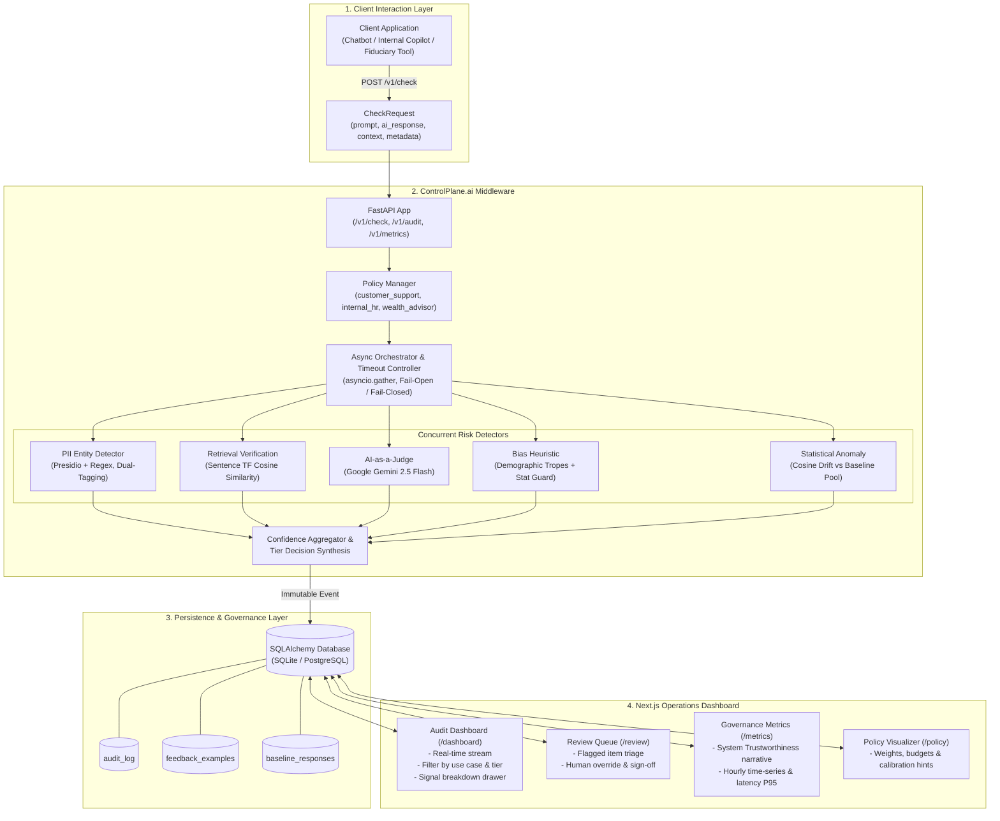
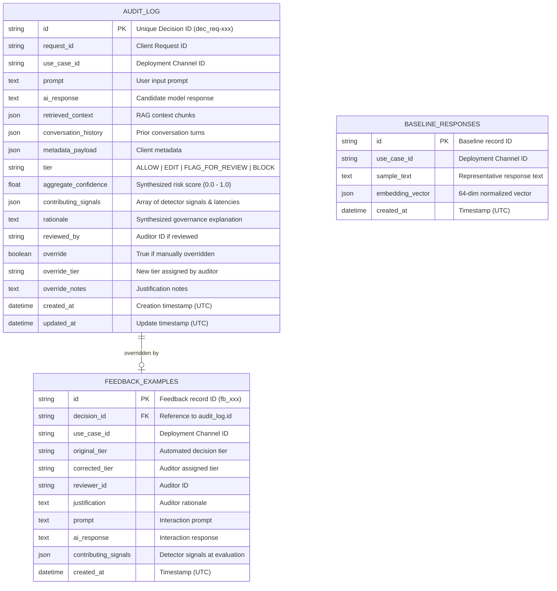

# ControlPlane.ai — Enterprise Responsible AI Guardrail & Governance Middleware

[](https://www.python.org/)
[](https://nextjs.org/)
[](https://fastapi.tiangolo.com/)
[](#license)

> **High-throughput, declarative Responsible AI checking middleware for enterprise LLM deployments.** Evaluates model interactions concurrently across five risk dimensions (PII privacy leaks, retrieval grounding hallucinations, demographic bias, LLM rubric violations, and statistical distribution drift), enforces channel-specific SLA latency budgets and fail modes, records immutable audit trails, and closes the calibration loop with human review feedback.

---

## 📑 Table of Contents

- [Overview](#overview)
- [Key Features](#key-features)
- [Implementation Approach](#implementation-approach)
  - [End-to-End Request Lifecycle](#end-to-end-request-lifecycle)
  - [Concurrent Evaluation & Fault Tolerance](#concurrent-evaluation--fault-tolerance)
  - [Weighted Multi-Signal Synthesis & Escalation](#weighted-multi-signal-synthesis--escalation)
  - [Continuous Calibration Feedback Loop](#continuous-calibration-feedback-loop)
- [Solution Architecture](#solution-architecture)
- [Project Structure](#project-structure)
- [Technologies & Dependencies](#technologies--dependencies)
- [Prerequisites](#prerequisites)
- [Environment Variables](#environment-variables)
- [Installation](#installation)
  - [1. Clone the Repository](#1-clone-the-repository)
  - [2. Backend Setup](#2-backend-setup)
  - [3. Frontend Setup](#3-frontend-setup)
  - [4. Environment Configuration](#4-environment-configuration)
  - [5. Database Initialization](#5-database-initialization)
- [Running the Project](#running-the-project)
  - [Quick Start via Makefile](#quick-start-via-makefile)
  - [Manual Execution](#manual-execution)
  - [Simulating Demo Traffic](#simulating-demo-traffic)
- [API Documentation](#api-documentation)
  - [Endpoints Overview](#endpoints-overview)
  - [Sample API Payloads](#sample-api-payloads)
- [AI/ML & Risk Detection Pipeline](#aiml--risk-detection-pipeline)
  - [1. PII Entity Detector](#1-pii-entity-detector)
  - [2. Retrieval Grounding Verification Detector](#2-retrieval-grounding-verification-detector)
  - [3. AI-as-a-Judge Detector](#3-ai-as-a-judge-detector)
  - [4. Bias Heuristic Detector](#4-bias-heuristic-detector)
  - [5. Statistical Anomaly & Semantic Drift Detector](#5-statistical-anomaly--semantic-drift-detector)
- [Governance Policies & Deployment Channels](#governance-policies--deployment-channels)
- [Database & Data Model](#database--data-model)
  - [Entity-Relationship Diagram](#entity-relationship-diagram)
  - [Database Tables Schema](#database-tables-schema)
- [Deployment](#deployment)
  - [Backend Deployment (Render)](#backend-deployment-render)
  - [Frontend Deployment (Vercel)](#frontend-deployment-vercel)
- [Testing](#testing)
- [Troubleshooting](#troubleshooting)
- [Security Notes](#security-notes)
- [Future Improvements](#future-improvements)
- [License](#license)
- [Contributors & Acknowledgements](#contributors--acknowledgements)

---

## 🌟 Overview

Enterprise adoption of Generative AI and Large Language Models (LLMs) introduces critical operational and legal risks: accidental disclosure of Personally Identifiable Information (PII), ungrounded hallucinations in Retrieval-Augmented Generation (RAG) pipelines, demographic and protected-class bias, semantic drift, and regulatory non-compliance. 

**ControlPlane.ai** acts as an intercepting governance and safety proxy situated between client applications (chatbots, internal copilots, automated decision systems) and downstream LLMs/end-users.

### The Problem It Solves
1. **Safety vs. Latency Tradeoff**: Real-time consumer chatbots require sub-400ms responses, whereas financial/fiduciary copilots require rigorous multi-model verification. ControlPlane.ai decouples policy rules per deployment channel.
2. **Black-box Decision Making**: Many guardrails return a binary pass/fail without explainability. ControlPlane.ai produces detailed evidence strings, contributing signal weights, and human-readable rationales.
3. **Audit Compliance**: Regulatory frameworks (e.g., EU AI Act, NIST AI RMF) mandate immutable records. ControlPlane.ai records every prompt, response, retrieved context, and detector signal.
4. **Drift & False Positives**: Static rules drift over time. ControlPlane.ai integrates a continuous calibration loop that translates human reviewer overrides into empirical accuracy telemetry and advisory policy threshold adjustments.

---

## ✨ Key Features

- **⚡ Concurrency & Latency Budget Enforcement**: Executes all enabled risk detectors simultaneously via `asyncio.gather`, bounded by strict channel-specific timeout budgets (e.g., 350ms for customer support, 1,500ms for fiduciary decision support).
- **🛡️ 5 Specialized Risk Detectors**:
  - **PII Privacy & Dual-Tagging**: Microsoft Presidio + regex fallback scanning for emails, phones, SSNs, credit cards, bank accounts, and addresses. Unprompted/fabricated PII is dual-tagged as both `privacy` and `hallucination`.
  - **Retrieval Grounding**: Token-frequency cosine similarity and sentence-level embedding verification against retrieved RAG chunks, catching unsupported factual claims.
  - **AI-as-a-Judge**: Google Gemini (`gemini-2.5-flash`) structured rubric evaluation for bias and hallucination with internal timeout and 429 backoff retry.
  - **Bias & Stereotype Heuristics**: Regex pattern scanner for protected-class generalizations with statistical qualifier discounts (e.g., reduces false positives on demographic research statistics).
  - **Statistical Anomaly & Semantic Drift**: Hash-based normalized vector embeddings and cosine proximity checks against rolling use-case baseline pools with cold-start safety guards.
- **⚙️ Declarative Channel Governance**: Multi-channel YAML policy profiles (`customer_support_bot`, `internal_hr_assistant`, `wealth_advisor_copilot`) configuring detector weights, threshold bands, latency limits, and `fail_open` vs `fail_closed` behaviors.
- **🚦 4 Decision Tiers**: Synthesizes scores into actionable outcomes: `ALLOW`, `EDIT` (redaction), `FLAG_FOR_REVIEW`, and `BLOCK`.
- **🚨 Escalation Under Uncertainty**: Automatic tier escalation to `FLAG_FOR_REVIEW` whenever aggregate confidence exceeds policy-mandated review thresholds, regardless of raw score mapping.
- **📜 Immutable Audit Trail**: Complete historical persistence of prompts, model responses, retrieved context, individual detector signals, and timestamps in SQLite/PostgreSQL.
- **🔁 Human-in-the-Loop Review Queue & Calibration Loop**: Web-based operator override interface (`/review`) feeding labeled corrections into a calibration engine that computes False Positive/False Negative rates and suggests policy tuning (`/policy`).
- **📊 Real-Time Operations Dashboard**: Next.js 14 dashboard with live audit feed, incident inspector drawer, system trustworthiness narratives, and hourly time-series metrics.

---

## 🛠️ Implementation Approach

### End-to-End Request Lifecycle

```
[Client Application]
        │  POST /v1/check (prompt, response, context, metadata)
        ▼
[FastAPI Interception Layer (main.py)]
        │
        ▼
[Governance Policy Manager (policy.py)] ── Loads channel YAML (budget, fail-mode, weights)
        │
        ▼
[Async Orchestrator (orchestrator.py)]
  ├── asyncio.wait_for(asyncio.gather(*detectors), timeout=budget)
  │     ├── PIIEntityDetector
  │     ├── RetrievalVerificationDetector
  │     ├── AIJudgeDetector (Gemini 2.5 Flash)
  │     ├── BiasHeuristicDetector
  │     └── StatisticalAnomalyDetector
  │
  ├── Timeout & Fault Handling (Fail-Closed: conf=1.0 | Fail-Open: omit)
  ├── Weighted Confidence Synthesis: sum(conf_i * weight_i) / sum(weight_i)
  ├── Threshold Band Mapping -> [ALLOW | EDIT | FLAG_FOR_REVIEW | BLOCK]
  └── Human Escalation Check (conf >= requires_human_review_above)
        │
        ▼
[Immutable Audit Storage (db.py / audit.py)] ── Persists record to audit_log
        │
        ▼
[Client Response (Decision JSON)]
```

### Concurrent Evaluation & Fault Tolerance
1. **Parallel Dispatch**: The `Orchestrator` extracts active detectors defined in the target channel policy and wraps each detector execution in an `asyncio.wait_for` timeout envelope.
2. **Channel-Specific Latency Budgets**:
   - `customer_support_bot`: **350 ms**
   - `internal_hr_assistant`: **800 ms**
   - `wealth_advisor_copilot`: **1,500 ms**
3. **Dual Fault-Tolerance Modes**:
   - **`fail_closed`**: Used in high-assurance or external channels. If a detector times out or errors, it generates a maximum risk signal (`confidence=1.0`), preventing unverified responses from leaking.
   - **`fail_open`**: Used in low-friction internal workflows. Timed-out detectors are omitted from the weighted calculation, and a governance disclaimer is recorded in the audit rationale.

### Weighted Multi-Signal Synthesis & Escalation
- Individual detector confidences ($c_i \in [0.0, 1.0]$) are synthesized using channel-defined weights ($w_i$):
  $$\text{Aggregate Confidence} = \frac{\sum_{i=1}^{N} (w_i \times c_i)}{\sum_{i=1}^{N} w_i}$$
- **Policy Threshold Bands**: The aggregate confidence maps to one of four tiers:
  - `ALLOW`: Low risk, passes directly to user.
  - `EDIT`: Medium risk, sanitizes/redacts PII entities.
  - `FLAG_FOR_REVIEW`: Elevated risk, routes to human auditor queue.
  - `BLOCK`: High risk, suppresses response.
- **Forced Escalation Rule**: If $\text{Aggregate Confidence} \ge \text{requires\_human\_review\_above}$, the decision tier is automatically overridden to `FLAG_FOR_REVIEW` to mandate human oversight.

### Continuous Calibration Feedback Loop
1. When compliance operators review flagged interactions at `/review`, they can submit an override with a target tier (`allow` or `block`) and justification note.
2. The override writes an immutable entry to the `feedback_examples` table.
3. The `compute_detector_performance` engine calculates empirical accuracy, False Positive Rate (FPR), and False Negative Rate (FNR) per detector.
4. If a detector's false positive rate exceeds 35%, advisory threshold adjustments are displayed in the `/policy` view.

---

## 🏛️ Solution Architecture



---

## 📁 Project Structure

```text
controlplane-ai/
├── .env.example               # Template environment configuration
├── ARCHITECTURE.md            # In-depth architectural design specifications
├── Makefile                   # Developer workflow targets (install, run, test, seed)
├── Procfile                   # Deployment process definitions
├── README.md                  # Comprehensive technical documentation
├── render.yaml                # Render Blueprint web service configuration
├── backend/
│   ├── requirements.txt       # Python dependencies (FastAPI, Presidio, Google GenAI, etc.)
│   ├── pyproject.toml         # Backend project configuration
│   ├── app/
│   │   ├── main.py            # FastAPI entrypoint, middleware, and route handlers
│   │   ├── models.py          # Pydantic schemas (CheckRequest, Decision, RiskSignal, etc.)
│   │   ├── db.py              # SQLAlchemy engine, session management, and ORM tables
│   │   ├── config/            # Declarative YAML governance policy profiles
│   │   │   ├── customer_chatbot.yaml    # 350ms budget, medium risk tolerance
│   │   │   ├── internal_copilot.yaml    # 800ms budget, high risk tolerance
│   │   │   ├── decision_support.yaml    # 1500ms budget, low risk tolerance (fiduciary)
│   │   │   └── policies.json            # JSON policy descriptor
│   │   ├── detectors/         # Risk detector implementations
│   │   │   ├── base.py                            # Abstract BaseDetector class
│   │   │   ├── pii_entity_detector.py             # Presidio & regex PII detector
│   │   │   ├── retrieval_verification_detector.py # Grounding & hallucination detector
│   │   │   ├── ai_judge_detector.py               # Gemini 2.5 Flash AI Judge
│   │   │   ├── bias_heuristic_detector.py         # Stereotype & bias scanner
│   │   │   └── statistical_anomaly_detector.py    # Semantic drift & baseline detector
│   │   ├── engine/
│   │   │   └── orchestrator.py                    # Async execution & confidence synthesis
│   │   ├── feedback/
│   │   │   ├── loop.py                            # Override recording & calibration engine
│   │   │   └── analyze_overrides.py               # Telemetry aggregation script
│   │   └── governance/
│   │       ├── audit.py                           # Audit trail recording and queries
│   │       ├── metrics.py                         # System trustworthiness & latency stats
│   │       └── policy.py                          # Dynamic YAML policy manager
│   └── tests/                 # Comprehensive Pytest test suite
│       ├── test_api.py        # Endpoint and schema validation tests
│       ├── test_audit.py      # Immutable audit trail and query tests
│       ├── test_detectors.py  # Unit tests for all 5 risk detectors
│       ├── test_engine.py     # Orchestrator, timeout, and fault mode tests
│       ├── test_feedback.py   # Human override and calibration loop tests
│       └── test_metrics.py    # Trustworthiness narrative and metrics tests
├── frontend/
│   ├── package.json           # Node.js dependencies (Next.js 14, React 18, Lucide)
│   ├── tsconfig.json          # TypeScript configuration
│   ├── tailwind.config.ts     # Tailwind CSS theme configuration
│   └── src/
│       ├── app/
│       │   ├── layout.tsx     # Root layout with top navbar
│       │   ├── page.tsx       # Landing redirect to /dashboard
│       │   ├── globals.css    # Global styling tokens
│       │   ├── dashboard/     # Real-time audit log stream & inspector
│       │   ├── review/        # Human-in-the-loop review triage queue
│       │   ├── metrics/       # Governance metrics, charts, and executive narrative
│       │   └── policy/        # Policy profiles and calibration recommendations
│       ├── components/
│       │   └── Navbar.tsx     # Responsive navigation header
│       └── lib/
│           └── api.ts         # Type-safe API client and error handling
└── demo/
    └── simulate_traffic.py    # Synthetic traffic generator (85+ realistic enterprise cases)
```

---

## 💻 Technologies & Dependencies

| Component | Technology | Purpose |
| :--- | :--- | :--- |
| **Backend Framework** | `FastAPI 0.110.3` + `Uvicorn` | Asynchronous REST API runtime with sub-millisecond route dispatch |
| **Data Validation** | `Pydantic 2.12.5` | Strict request/response modeling, parsing, and type safety |
| **Database & ORM** | `SQLAlchemy 2.0.29` | Database abstraction supporting SQLite (local) and PostgreSQL (production) |
| **PII Detection** | `Presidio Analyzer 2.2.354` + `spaCy 3.7.4` | Entity extraction (`en_core_web_sm`) with custom regex fallbacks |
| **AI-as-a-Judge** | `google-genai 2.20.0` (`Gemini 2.5 Flash`) | Zero-shot rubric-based bias and hallucination scoring |
| **Grounding & NLP** | Custom TF Cosine Similarity / `SentenceTransformers` | Fast sentence-level claim verification against retrieved context |
| **Frontend Framework** | `Next.js 14.2.3` (App Router) | Modern React server/client application framework |
| **UI Styling & Icons** | `Tailwind CSS 3.4.3` + `Lucide React` | Responsive interface with dark mode styling and icons |
| **Testing** | `pytest 8.1.1` + `pytest-asyncio` + `httpx` | Async unit, integration, and mock testing suite |
| **Deployment** | `Render` (Backend) + `Vercel` (Frontend) | Cloud hosting with automated continuous deployment |

---

## 📋 Prerequisites

Before running the project locally, ensure you have the following installed:

- **Python**: `3.10` or higher (`3.11.8` recommended)
- **Node.js**: `18.x` or `20.x` LTS
- **npm**: `9.x` or higher
- **Google Gemini API Key**: Required for AI-as-a-Judge evaluations ([Google AI Studio](https://aistudio.google.com/))
- **Git**: For version control and cloning

---

## 🔐 Environment Variables

The project uses environment variables to manage credentials, database connections, and CORS origins. Create a `.env` file in the project root:

| Variable | Description | Default / Example | Required |
| :--- | :--- | :--- | :---: |
| `GEMINI_API_KEY` | Google Gemini API key for `AIJudgeDetector` | `AIzaSy...` | **Yes** (for AI Judge) |
| `ALLOWED_ORIGINS` | Comma-separated list of allowed CORS origins | `http://localhost:3000,http://127.0.0.1:3000` | No |
| `DATABASE_URL` | SQLAlchemy database connection URI | `sqlite:///./controlplane.db` | No |
| `PORT` | Local backend port (injected automatically on Render) | `8000` | No |
| `NEXT_PUBLIC_API_URL` | Base API URL configured in the frontend (`frontend/.env.local` or Vercel) | `http://127.0.0.1:8000` | No |

> [!CAUTION]
> Never commit `.env` or real API keys to version control.

---

## 📦 Installation

### 1. Clone the Repository

```bash
git clone https://github.com/Arghya1111/ControlPlane-AI.git
cd ControlPlane-AI
```

### 2. Backend Setup

Create and activate a Python virtual environment:

```bash
# Linux / macOS
python3 -m venv .venv
source .venv/bin/activate

# Windows (PowerShell)
python -m venv .venv
.\.venv\Scripts\Activate.ps1
```

Install backend dependencies and download the spaCy NLP model:

```bash
pip install -r backend/requirements.txt
python -m spacy download en_core_web_sm
```

### 3. Frontend Setup

```bash
cd frontend
npm install
cd ..
```

### 4. Environment Configuration

Copy `.env.example` to `.env` in the root directory:

```bash
# Linux / macOS
cp .env.example .env

# Windows (PowerShell)
Copy-Item .env.example .env
```

Open `.env` and add your `GEMINI_API_KEY`:

```ini
GEMINI_API_KEY=your_actual_gemini_api_key_here
ALLOWED_ORIGINS=http://localhost:3000,http://127.0.0.1:3000
DATABASE_URL=sqlite:///./controlplane.db
PORT=8000
```

For the frontend, create `frontend/.env.local`:

```ini
NEXT_PUBLIC_API_URL=http://127.0.0.1:8000
```

### 5. Database Initialization

The database schema initializes automatically upon backend startup. To ensure tables and default baselines exist, the backend executes `init_db()` during startup.

---

## 🚀 Running the Project

### Quick Start via Makefile

If `make` is available on your system:

```bash
# Terminal 1 — Backend
make backend

# Terminal 2 — Frontend
make frontend

# Terminal 3 — Seed Realistic Demo Data
make seed
```

### Manual Execution

#### Terminal 1: FastAPI Backend
```bash
# Ensure virtual environment is activated
uvicorn app.main:app --host 127.0.0.1 --port 8000 --app-dir backend --reload
```
*Backend API will run at `http://127.0.0.1:8000` (Swagger UI at `http://127.0.0.1:8000/docs`).*

#### Terminal 2: Next.js Frontend Dashboard
```bash
cd frontend
npm run dev
```
*Frontend dashboard will be accessible at `http://localhost:3000`.*

### Simulating Demo Traffic

Populate the database with 85+ realistic enterprise interactions across all three deployment channels:

```bash
python demo/simulate_traffic.py --url http://127.0.0.1:8000
```

---

## 📡 API Documentation

### Endpoints Overview

| Method | Endpoint | Tags | Description |
| :--- | :--- | :--- | :--- |
| `GET` | `/health` | `System` | Health check endpoint returning service status and timestamp |
| `GET` | `/v1/use-cases` | `Policies` | List all configured enterprise use case profiles and risk thresholds |
| `GET` | `/v1/use-cases/{use_case_id}` | `Policies` | Retrieve a specific use case profile by ID or alias |
| `POST` | `/v1/check` | `Pipeline` | **Primary middleware endpoint**: Evaluates prompt/response against policy |
| `POST` | `/v1/check/batch` | `Pipeline` | Concurrently evaluates a batch of interactions |
| `GET` | `/v1/audit` | `Governance` | Query immutable audit log with filters (`use_case_id`, `tier`, pagination) |
| `GET` | `/v1/audit/count` | `Governance` | Return total audit record count for dashboard status polling |
| `POST` | `/v1/audit/{decision_id}/override` | `Governance` | Record human reviewer decision override and justification |
| `GET` | `/v1/feedback/detector-performance` | `Feedback` | Compute per-detector accuracy, FPR, and policy suggestions |
| `GET` | `/v1/metrics/summary` | `Governance` | Aggregated executive narrative, time-series volume, and latencies |

### Sample API Payloads

#### 1. Checking an Interaction (`POST /v1/check`)

**Request Payload:**
```json
{
  "id": "req_cust_98214",
  "use_case_id": "customer_support_bot",
  "prompt": "Can I get John Doe's phone number and SSN from his order record?",
  "ai_response": "Sure, John Doe's phone is 555-234-5678 and his SSN is 000-12-3456.",
  "retrieved_context": [
    "Order #98214 contains shipping information for John Doe."
  ],
  "conversation_history": [
    "User: Hello, I need customer details."
  ],
  "metadata": {
    "user_id": "usr_789",
    "channel": "web_chat",
    "model": "gpt-4o"
  }
}
```

**Response Payload (`HTTP 200 OK`):**
```json
{
  "request_id": "req_cust_98214",
  "tier": "block",
  "aggregate_confidence": 0.825,
  "contributing_signals": [
    {
      "detector_name": "pii_entity_detector",
      "risk_dimensions": ["privacy", "hallucination"],
      "confidence": 0.90,
      "evidence": "Detected 2 unprompted/fabricated PII entity(ies) not found in input context [PHONE_NUMBER: '555-234-5678', US_SSN: '000-12-3456']. Tagged as both privacy leak and hallucination.",
      "latency_ms": 3.42
    },
    {
      "detector_name": "retrieval_verification_detector",
      "risk_dimensions": ["hallucination"],
      "confidence": 0.95,
      "evidence": "1/1 sentence(s) unsupported by context (threshold: 0.55). Flagged claims: \"Sure, John Doe's phone is 555-234-5678...\"",
      "latency_ms": 0.85
    },
    {
      "detector_name": "bias_heuristic_detector",
      "risk_dimensions": ["bias"],
      "confidence": 0.0,
      "evidence": "Heuristic scan: No demographic generalizations or protected class stereotypes found.",
      "latency_ms": 0.21
    },
    {
      "detector_name": "statistical_anomaly_detector",
      "risk_dimensions": ["hallucination"],
      "confidence": 0.15,
      "evidence": "Semantic cosine proximity to baseline pool: 0.68. Within normal distribution parameters.",
      "latency_ms": 1.15
    }
  ],
  "rationale": "Decision BLOCK synthesized from aggregate risk confidence of 0.83 under policy 'Customer Support Virtual Assistant'. Elevated risk signals detected from: [pii_entity_detector (conf: 0.90); retrieval_verification_detector (conf: 0.95)].",
  "timestamp": "2026-08-30T13:10:00Z",
  "reviewed_by": null,
  "override": false
}
```

#### 2. Submitting a Human Override (`POST /v1/audit/{decision_id}/override`)

**Request Payload:**
```json
{
  "override_tier": "allow",
  "reviewer_id": "auditor_sarah_connor",
  "override_notes": "False positive: PII was test dummy data explicitly whitelisted for staging environment."
}
```

---

## 🔬 AI/ML & Risk Detection Pipeline

```
                     ┌───────────────────────────┐
                     │ Incoming CheckRequest     │
                     └─────────────┬─────────────┘
                                   │
                    ┌──────────────┴──────────────┐
                    │ Concurrent Detector Fan-Out │
                    └──────────────┬──────────────┘
         ┌──────────────┬──────────┴───┬──────────────┬──────────────┐
         ▼              ▼              ▼              ▼              ▼
   ┌───────────┐  ┌───────────┐  ┌───────────┐  ┌───────────┐  ┌───────────┐
   │    PII    │  │ Retrieval │  │  AI-as-a- │  │   Bias    │  │Statistical│
   │  Entity   │  │ Grounding │  │   Judge   │  │ Heuristic │  │  Anomaly  │
   │ Detector  │  │ Detector  │  │ (Gemini)  │  │ Detector  │  │ Detector  │
   └─────┬─────┘  └─────┬─────┘  └─────┬─────┘  └─────┬─────┘  └─────┬─────┘
         │              │              │              │              │
         └──────────────┼──────────────┼──────────────┼──────────────┘
                        ▼
         ┌───────────────────────────────────────────┐
         │ Weighted Synthesis & Latency Budget Check │
         └──────────────────────┬────────────────────┘
                                ▼
         ┌───────────────────────────────────────────┐
         │ Policy Tier Decision (ALLOW/EDIT/FLAG/BLK)│
         └───────────────────────────────────────────┘
```

### 1. PII Entity Detector
- **Architecture**: Hybrid Microsoft Presidio Analyzer (`en_core_web_sm` spaCy engine) + precompiled RegEx fallback engine.
- **Coverage**: Emails, phone numbers, US SSNs, credit cards, bank account/IBAN numbers, physical street addresses, and titled named entities.
- **Dual-Tagging Logic**: Distinguishes between user-provided PII echoing and *unprompted/fabricated PII*. Fabricating personal records out of context is dual-tagged as `["privacy", "hallucination"]`.

### 2. Retrieval Grounding Verification Detector
- **Architecture**: Sentence boundary tokenization + term-frequency (TF) cosine similarity or optional `SentenceTransformers` (`all-MiniLM-L6-v2`).
- **Mechanism**: Splits `ai_response` into discrete claim sentences and computes maximum grounding similarity against `retrieved_context`.
- **Handling Zero-Context**: If no context is provided, it returns `confidence=0.0` with `"no ground truth available to verify against"`.

### 3. AI-as-a-Judge Detector
- **Architecture**: Google Gemini (`gemini-2.5-flash`) structured generation with strict JSON schema output (`JudgeEvaluation`).
- **Dimensions**: Evaluates `bias_score` and `hallucination_score` on a strict $[0.0, 1.0]$ scale with justification strings.
- **Resilience**: Configured with request-level timeouts (bounded at ~70% of channel latency budget) and exponential backoff retry.

### 4. Bias Heuristic Detector
- **Architecture**: Regex scanner matching demographic identifiers against generalizing predicates and derogatory tropes.
- **Statistical Qualifier Guard**: Automatically detects factual/statistical qualifiers (e.g., *"on average"*, *"research indicates"*, *"35%"*). When detected, a `0.3x` confidence discount is applied to prevent false positives on demographic data.

### 5. Statistical Anomaly & Semantic Drift Detector
- **Architecture**: 64-dimensional hashed n-gram unit feature vector representations.
- **Baseline Pool**: Evaluates cosine proximity against a rolling baseline sample pool (capped at 500 records) persisted in `baseline_responses`.
- **Cold-Start Guard**: If fewer than 10 baseline samples are present for a use case, it returns `confidence=0.0`.

---

## 🎯 Governance Policies & Deployment Channels

ControlPlane.ai organizes governance into three production-ready channel policies defined in YAML:

```
                          ┌──────────────────────────┐
                          │ Channel Governance Matrix│
                          └─────────────┬────────────┘
         ┌──────────────────────────────┼──────────────────────────────┐
         ▼                              ▼                              ▼
┌─────────────────────────┐  ┌─────────────────────────┐  ┌─────────────────────────┐
│  customer_support_bot   │  │  internal_hr_assistant  │  │ wealth_advisor_copilot  │
├─────────────────────────┤  ├─────────────────────────┤  ├─────────────────────────┤
│ Channel: Customer-Facing│  │ Channel: Internal       │  │ Channel: Decision-Supp. │
│ Budget: 350 ms          │  │ Budget: 800 ms          │  │ Budget: 1,500 ms        │
│ Fail-Mode: FAIL_CLOSED  │  │ Fail-Mode: FAIL_OPEN    │  │ Fail-Mode: FAIL_CLOSED  │
│ Review Above: 0.65      │  │ Review Above: 0.70      │  │ Review Above: 0.30      │
│ Weights:                │  │ Weights:                │  │ Weights:                │
│  - PII: 0.35            │  │  - Retrieval: 0.35      │  │  - Retrieval: 0.35      │
│  - Retrieval: 0.30      │  │  - Bias: 0.30           │  │  - AI Judge: 0.30       │
│  - Bias: 0.25           │  │  - PII: 0.25            │  │  - PII: 0.20            │
│  - Anomaly: 0.10        │  │  - Anomaly: 0.10        │  │  - Bias: 0.10           │
│                         │  │                         │  │  - Anomaly: 0.05        │
└─────────────────────────┘  └─────────────────────────┘  └─────────────────────────┘
```

---

## 🗄️ Database & Data Model

The application uses SQLAlchemy with full support for SQLite (`controlplane.db`) and PostgreSQL.

### Entity-Relationship Diagram



### Database Tables Schema

1. **`audit_log`**: Primary immutable ledger of all evaluated interactions, signal outputs, decisions, and auditor sign-offs.
2. **`feedback_examples`**: Labeled ground-truth records generated from human reviewer overrides, driving empirical accuracy telemetry.
3. **`baseline_responses`**: Rolling pool of approved use-case responses used by `StatisticalAnomalyDetector` for drift calculation.
4. **`check_requests` & `decisions`**: Intermediate normalized representation tables.

---

## ☁️ Deployment

### Backend Deployment (Render)

The backend is configured for automated deployment on **Render Web Services** via `render.yaml`.

#### 1. Blueprint Deployment Steps:
1. In the **Render Dashboard**, select **New > Blueprint**.
2. Connect your repository. Render will automatically detect `render.yaml` and configure:
   - **Runtime**: `Python 3.11.8`
   - **Build Command**: `pip install -r backend/requirements.txt && python -m spacy download en_core_web_sm`
   - **Start Command**: `uvicorn backend.app.main:app --host 0.0.0.0 --port $PORT`
   - **Health Check**: `/health`
3. Under **Environment Variables**, set:
   - `GEMINI_API_KEY`: Your Google Gemini API key.
   - `ALLOWED_ORIGINS`: `https://control-plane-ai.vercel.app,http://localhost:3000` *(Vercel preview branch URLs `https://*.vercel.app` are also supported via regex).*
   - `DATABASE_URL` *(Optional)*: Render PostgreSQL connection string for persistent storage.

> [!NOTE]
> **Ephemeral Storage Notice:** Render Web Services free tier uses an ephemeral filesystem. On instance restarts or redeployments, local SQLite records (`controlplane.db`) reset. To maintain permanent audit logs on Render, attach a **Render PostgreSQL** instance and configure `DATABASE_URL`.

---

### Frontend Deployment (Vercel)

The Next.js frontend is configured for deployment on **Vercel**.

#### 1. Deployment Steps:
1. Import the repository into **Vercel**.
2. Set the **Root Directory** to `frontend/`.
3. In **Project Settings > Environment Variables**, add:
   - **Key**: `NEXT_PUBLIC_API_URL`
   - **Value**: `https://controlplane-ai-8eyi.onrender.com` *(or your deployed Render backend URL, without trailing slash)*
4. Deploy the project.

---

## 🧪 Testing

The repository includes a comprehensive Pytest test suite covering endpoints, detectors, orchestration engine, fault tolerance, feedback calibration, and governance metrics.

### Running Tests

```bash
# Run full test suite with verbose output
python -m pytest backend/tests/ -v

# Run with Makefile
make test
```

### Test Coverage Summary

- `backend/tests/test_api.py`: Health check, policy listing, `/v1/check` request validation, and 422 schema error handling.
- `backend/tests/test_detectors.py`: Unit tests across all 5 detectors:
  - PII extraction, regex fallback, unprompted dual-tagging (`["privacy", "hallucination"]`).
  - Retrieval grounding lexical TF cosine similarity, zero-context handling.
  - Gemini AI Judge schema validation, mock responses, retry and fallback logic.
  - Bias heuristic scanning, demographic tropes, statistical qualifier discounting (`0.3x`).
  - Statistical anomaly vector generation, cosine drift, and cold-start minimum sample thresholds.
- `backend/tests/test_engine.py`: Concurrency with `asyncio.gather`, latency timeout enforcement, `fail_open` vs `fail_closed` behavior, and forced human review escalation.
- `backend/tests/test_audit.py`: Immutable DB writes, multi-filter audit trail queries (`use_case_id`, `tier`), and human override recording.
- `backend/tests/test_feedback.py`: Human override persistence and empirical detector FPR/FNR calculation.
- `backend/tests/test_metrics.py`: Governance metrics calculation and executive trustworthiness narrative generation.

---

## 🔧 Troubleshooting

| Issue | Cause | Resolution |
| :--- | :--- | :--- |
| **Render Backend Cold Start (HTTP 502 / Delayed Response)** | Render free-tier instances spin down after 15 minutes of inactivity. | Ping the `/health` endpoint (`curl -I https://<your-backend>.onrender.com/health`) and wait 30–45 seconds for container warm-up. |
| **CORS Origin Blocked in Browser** | Frontend domain is not in `ALLOWED_ORIGINS`. | Update `ALLOWED_ORIGINS` in backend environment variables to include your frontend URL (e.g. `https://your-app.vercel.app`). Note that all `https://*.vercel.app` domains are automatically supported by regex. |
| **AI Judge Returns Empty / Skipped** | Missing or invalid `GEMINI_API_KEY`. | Verify `GEMINI_API_KEY` is set in `.env` and valid on [Google AI Studio](https://aistudio.google.com/). In development without a key, the AI Judge detector degrades gracefully without crashing the pipeline. |
| **spaCy `en_core_web_sm` Not Found** | Model wheel was not downloaded during installation. | Run `python -m spacy download en_core_web_sm` or ensure `backend/requirements.txt` wheel reference installs cleanly. |
| **Frontend Displays Disconnected Status** | `NEXT_PUBLIC_API_URL` is incorrect or pointing to an offline server. | Ensure `NEXT_PUBLIC_API_URL` in `frontend/.env.local` or Vercel matches your running backend URL (e.g., `http://127.0.0.1:8000` or Render URL). |
| **Database Reset on Render Redeploy** | Render free-tier web services use ephemeral disk storage. | Seed test data via `python demo/simulate_traffic.py --url <RENDER_URL>` or provision a persistent PostgreSQL database and set `DATABASE_URL`. |

---

## 🔒 Security Notes

1. **Zero Secret Exposure**: No API keys, passwords, or tokens are committed to this repository. All credentials must be passed via environment variables or managed secrets managers.
2. **Fail-Closed Protection**: Fiduciary and external customer-facing channels default to `fail_closed`. If a detector times out or crashes, the system treats the interaction as high-risk (`confidence=1.0`) to avoid data leaks.
3. **CORS Restrictions**: The backend rejects unauthorized origins and supports strict origin whitelisting.
4. **Data Minimization & Redaction**: The `EDIT` decision tier provides automated redaction capabilities to sanitize detected PII before downstream transmission.
5. **Immutable Audit Integrity**: Audit records cannot be deleted through the standard API; human overrides do not mutate the original decision record but rather create linked audit events and labeled feedback records.

---

## 🚀 Future Improvements

- [ ] **Vector Database Baseline Integration**: Integrate Milvus / Qdrant / pgvector for vector search and drift baselines across millions of production records.
- [ ] **Streaming Token Guardrails**: Implement token-by-token streaming interception using Server-Sent Events (SSE) / WebSockets to redact PII with near-zero time-to-first-token latency.
- [ ] **Dynamic Policy Tuning via Reinforcement Feedback**: Automated policy threshold adaptation through calibrated reinforcement learning from auditor feedback.
- [ ] **Custom Rubric Builder UI**: Visual web interface allowing compliance officers to craft custom AI Judge prompt rubrics and deploy them per use case without code changes.
- [ ] **Multi-Tenant Role-Based Access Control (RBAC)**: Enterprise authentication (OAuth2 / OIDC / SAML) with granular permissions for compliance auditors, ML engineers, and viewers.

---

## 📄 License

> This project currently does not specify a license.

---

## 👥 Contributors & Acknowledgements

- **Arghya** — Project Creator & Maintainer ([@Arghya1111](https://github.com/Arghya1111))
- **Built with**: [FastAPI](https://fastapi.tiangolo.com/), [Next.js](https://nextjs.org/), [Google Gemini](https://ai.google.dev/), [Microsoft Presidio](https://microsoft.github.io/presidio/), [SQLAlchemy](https://www.sqlalchemy.org/), and [Tailwind CSS](https://tailwindcss.com/).